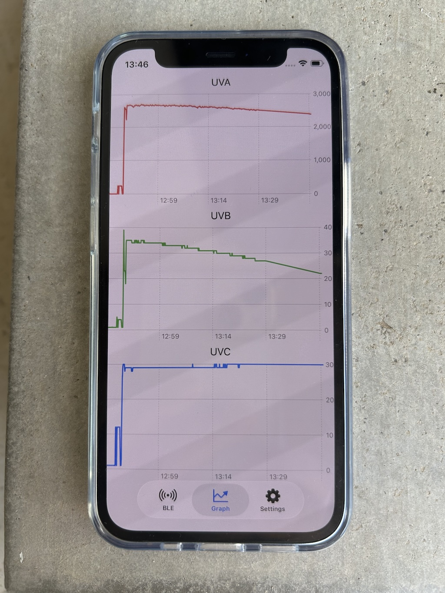
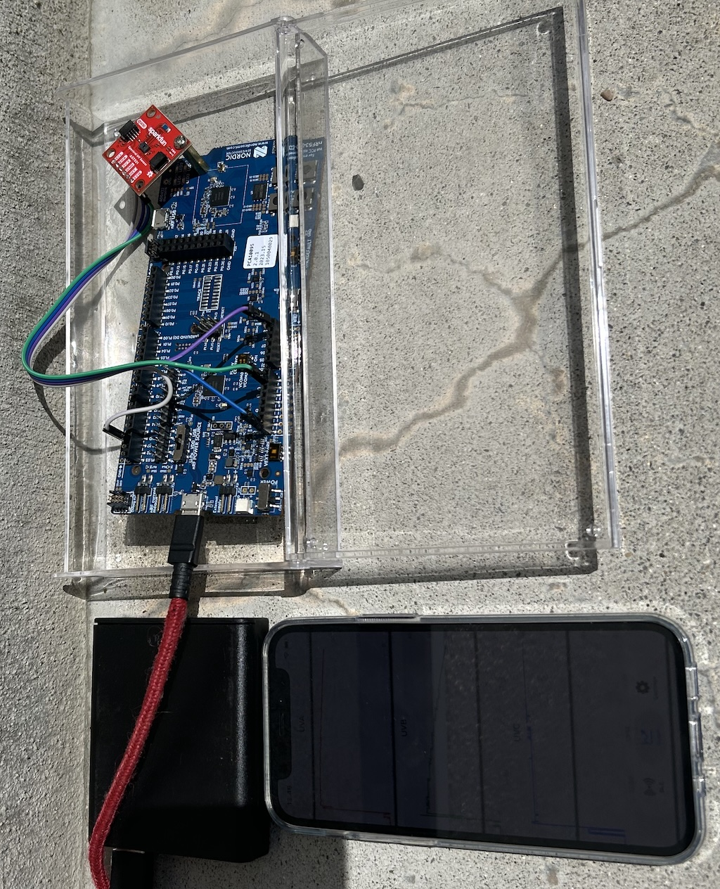

# BLE_I2C_FFF8
Bluetooth Low Energy Data Viewer app with UUID:FFF8-FFFA

| Screenshot 1 | Screenshot 2 |
|--------|--------|
|  |  |

```
Service UUID : 0xFFF8
Value notify characteristic UUID : 0xFFF9
Config read/write characteristic UUID : 0xFFFA
```

Value ID
|ID|Name|Datatype|Description|
|----|----------------------|---------|------------|
|0x10|Timestamp             |UInt32   |Unix time   |
|0x11|Timestamp micro second|UInt32   |micro second|
|0x12|Tempereture           |Float(4b)|Celsius     |
|0x13|Humidity(persent)     |Float(4b)|percent     |
|0x14|Visible Light strength|UInt16   |light       |
|0x15|Light UVA             |UInt16   |UVA light   |
|0x16|Light UVB             |UInt16   |UVB light   |
|0x17|Light UVC             |UInt16   |UVC light   |

Notify data format
| ID(UInt8) | Length(UInt8) | Data(Variable len) | ID | Length | Data |...
Use little endian

Config commands 
|ID|Name|
|----|-----------|
|0x11|Read value|
|0x12|Read result|
|0x13|Write value|

Config ID
|ID|Name|Datatype|Description|
|----|-------------------------|------|-----------------------|
|0xC0|Device name              |String|Advertising device name|
|0xC1|Set Device time          |UInt32|Unix time              |
|0xC2|Set Device time micro sec|UInt32|micro sec              |
|0xC3|Data send interval       |UInt32|Seconds                |
|0xC4|Data send interval       |UInt32|Micro seconds          |
|0xC5|Power off timer          |UInt32|power off timer seconds|

Config data format
| CMD(UInt8) | ID(UInt8) | Length(UInt8) | Data(Variable len) | CMD | ID | Length | Data |...
Use little endian

nRF5340 I2C PIN connection
| AS7331 Pin | nRF5340-DK Connection | Description |
|------------|-----------------------|-------------|
| VIN        | 3.3V pin              | Connect to a pin labeled "3V3" or "VDD" |
| GND        | GND pin               | Connect to any pin labeled "GND" |
| SDA        | SDA (Analog Pin A4)   | Corresponds to GPIO P0.26 |
| SCL        | SCL (Analog Pin A5)   | Corresponds to GPIO P0.27 |

nRF5340 FW build
cmake:3.27.0
command:west build -p -b nrf52840dk_nrf52840

```
export PATH="/Users/torui/venvs/ncs/bin/cmake:$PATH"
west build -b nrf5340dk_nrf5340_cpuapp

```
